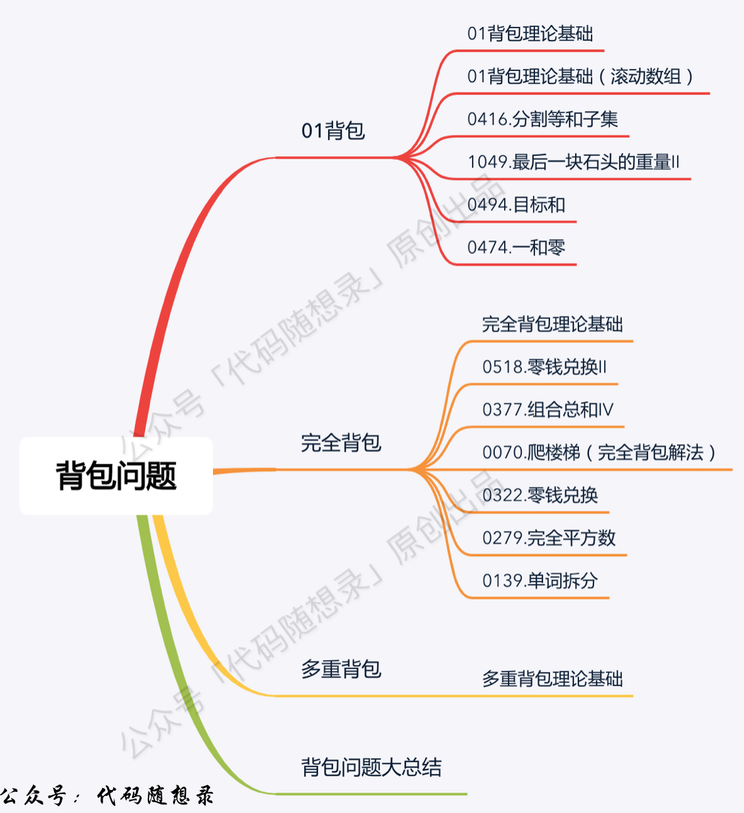
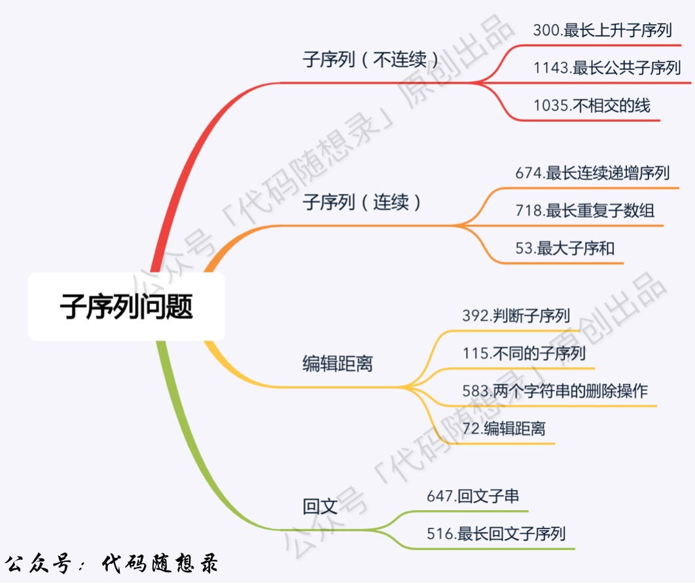

# Algorithms
### 代码随想录
种类 | 数量
-----| -----
1.数组 AR | 11
2.链表 LL | 11
3.哈希表 HM | 13
4.字符串 ST | 10
5.双指针 PP | 18
6.栈和队列 QU | 16
7.二叉树 BS| 60
8.回溯 BT | 15
9.贪心 GD | 17
10.动态规划 DP | 45
11.单调栈 DD | 5
12.图 GR | 25
13.额外 EX | 35
14.others OT | 7
总数 | 286


<!--  -->








## Note


## Coding Interview
#### JPMC
(2022-11-24) 912, 1356, 1328, 392, game winner, array reduction

https://www.geeksforgeeks.org/minimum-number-of-distinct-elements-after-removing-m-items/?ref=gcse

https://www.geeksforgeeks.org/maximum-index-a-pointer-can-reach-in-n-steps-by-avoiding-a-given-index-b/

https://www.geeksforgeeks.org/minimize-cost-to-reduce-the-array-to-a-single-element-by-given-operations/

https://leetcode.com/discuss/interview-question/528041/mathworks-edg-new-grad-oa-2020&#8205;&#8204;&#8204;&#8205;&#8204;&#8205;&#8204;&#8205;&#8205;&#8204;-ideal-numbers-in-a-range

https://www.1point3acres.com/bbs/thread-944933-1-1.html

https://www.1point3acres.com/bbs/thread-943018-1-1.html


转码时要注意：学东西要多花时间学“根”，少花时间学“叶”
根，就是基础，就是原理。叶，就是在这些基础上的衍生的工具。前者变化慢，影响力大。后者变化快，影响力小。
转码要成功，这些基础要扎实:

数据结构：
stack, queue, list, heap, hashmap, tree 各有什么特点，再哪些场景下适合使用。

语言基本概念：
class, function, interface, abstract class, inheritance, method overloading, static method, instance method, reference vs pointer, garbage collection, statically typed vs dynamically typed, compilation vs interpretation, virtual machine, JIT (just in time compilation), stack memory vs heap memory， thread vs process vs coroutine

操作系统基本概念：
二进制，文件系统（file system）， 内存管理，kernel space vs user space, linux bash, linux file permissioning (chmod), linux pipes

网络基本概念：
http, tcp vs udp, web server, web request (一个web server 收到 web request 以后怎么处理，怎么返回数据的？）, xml, html, javascript (typescript), 现代 javascript 怎么在本地浏览器运行的。 面试最喜欢问的问题： 你在你浏览器打入一个网页，按回车键开始，直到这个网页出现，这当中发生了些什么？

分布式系统基本概念：
Database (SQL vs NoSQL), Transactions (ACID), Messaging Queues, Load Balancing, Hashing, Master-Slave, Replication, CAP theorem.

你光刷题，就算进去某个大厂，不牢牢掌握以上知识，也出不了活（除非去做哪些平台有人给你搭好，你在上面填业务逻辑就行的那种产品工程师，所谓“API Boy”， 这和software engineering 没啥关系 ）。你基础打好了，用什么语言，什么框架，都是细枝末节。就好比，你知道这个世界上有个东西叫锤子，有个东西叫螺丝，有个东西叫螺帽，有个东西叫钉子，知道他们的工作原理，应用场景。你别这些没搞明白，花时间钻研某个牌子的锤子外面涂的什么颜色，把手是塑料的还是铁的，放在盒子里头朝上还是朝下，这就是学了叶子没学根，本末倒置了。
最后，哪怕失业在家，也别去肺部X光片厂。
最后贡献75道算法必刷题： https://www.techinterviewhandbook.org/grind75 必刷不是指高频题，而是指很有代表性的，对某些常用技巧和概念有强化意义的题。若能每道题背后技巧原理吃透，就算打通任督二脉了。


个人的刷题路径
1. 刷easy题。主要寻找做题的感觉。
2. 刷linkedlist, tree。 原因一是面试中这两类题考的频率较高， 原因二是刷这两类题有助于对递归的理解， 为后面刷DFS打下基础。
3. 刷DFS。 DFS非常重要，因为大部分 brute force 基本都可以用dfs来求解。 刚开始刷DFS， 可以重点关注pemutation 和 combination的题目， leetcode 这两类题也挺多的。 然后开始总结， 去理解 “状态(state)” 这个概念，对于每道DFS问题， 要清晰的定义出 “状态（state)”， 以及状态如何转移， 这方面的基础可以为DP打下基础。
4. 记忆化搜索。 也就是DFS + 记忆。记忆的存储通常用map或者set即可。
5. DP。 记忆化搜索刷熟了，可以尝试开始刷经典的DP，理解状态 和 状态转移，尝试自己去写出状态转移方程。 尝试DP的两种实现方式 top-down(也就是记忆化搜索) 和 bottom-up
6. 高频数据结构， stack, queue, heap。 这三个数据结构在面试中出现频率非常高。
7. 其他重点专题: sliding window, sort（特别是快速排序 和 归并排序)， two pointers, graph, bfs, trie, union find


个人的其他刷题方式，我通常会结合不同的刷题方式。
1. 只看题，不写代码。 我通常会从brute force 开始求解， 然后逐步优化。 如果10-20分钟以内想不出解法， 直接去看答案了。
2. 对于一道题， 精耕细作， 举一反三。 精耕细作是指 学习优秀代码， 一题多解 以及 如何从brute force推导到最优解，并且了解这个过程的思路是如何形成的。 举一反三是指看类似的题目， 总结共同特性。
3. 参加竞赛。 训练快速做题， debug ， 写代码的能力。

其他tips
1. 刷题初期追求量，一道题不可花太长时间， 控制在30分钟以内
2. 最好不依赖IDE， 训练直接在leetcode 页面写代码。
3. 定期回过头总结刷过的题。
4. 不要盲目刷题， 适可而止，刷够了，要转战到面试技巧上面， 面试技巧和刷题一样重要。（因为我就有一个面试挂在面试技巧上面， 非常后悔）

刷题感悟：理解 子问题。 对于每一个问题， 定义子问题是什么， 然后如何从子问题推导出原问题的解。 对于DFS， 就是穷举每个子问题。 DP就是因为存在重叠子问题。 贪心就是每次以子问题的最优解作为原问题的最优解。

非常同意楼主观点 另外一个自己觉得有用的小tip是找一个小本本总结不同topic的思路和知识点（用自己的语言和理解）过几个月或几年再看可以帮助迅速refresh memory快速进入面试状态

我面试的时候， 习惯把敲代码分成两个步骤。
第一个步骤是 写出代码的框架（如定义子函数）， 写完框架后， 再和面试官解释框架代码，解释函数的输入输出。
第二个步骤是 直接填充代码细节（这个过程我专注于填充代码细节， 不会和面试官交流）
写完代码之后， 再重头到尾把代码和面试官讲一遍。


```python
#!/usr/bin/env python

# import modules used here -- sys is a very standard one
import sys

# Gather our code in a main() function
def main():
    print 'Hello there', sys.argv[1]
    print 'argv = ', len(sys.argv)
#     print 'argc = \n', len(sys.argc)
    # Command line args are in sys.argv[1], sys.argv[2] ...
    # sys.argv[0] is the script name itself and can be ignored

# Standard boilerplate to call the main() function to begin
# the program.
if __name__ == '__main__':
    main()
```

排序算法、查找算法、二叉树遍历这些最基本的一定要很顺溜的写下来，其他的就看自己去拓展了。

> https://github.com/girliemac/a-picture-is-worth-a-1000-words/tree/main/algorithms

## Coding interview
刚开始刷 别自己蛮干，有钱可以考虑上个班突击，或者看几个大神那一系列的视频，跟着大神的视频把基本的20几个tag先过一遍，或者把最简单的10个左右能cover easy level的tag先过一遍， 最最高频，最最基础的的 BS二分，分治，二叉树，链表，DFS BFS， 。。etc 先过一遍
DP ， segment tree/BIT 这些起码 medium 以上的先留一留
搜一下 残酷刷题群 或者 youtube 每日一题，找那个 excel文档，guan大神每个tag基本要连着刷 3~5题，按这个刷 进阶
还有花花酱 和 古城算法 也不错，不过残酷群是目测几年来一直在update更新的，有些大神已经上岸了所以不再更新的

每个类别，dfs，bfs，queue，stack，trie tree，binary tree，graph， binary search，等各刷了10道题

youtube上面有个叫花花还有古城算法，你按照那个刷。尤其推荐花花，我记得他有个刷题单子。核心就是相近的题目得放在一起刷，技能体会细节的不同，又能知道哪些是通用的。

`
题目理解(关键概念)+提出问题(输入输出类型/edge cases/算法使用环境要求)+讨论可行方案(分析时间空间复杂度)+确定最合理方案(保证在规定时间内可以写完/合理简化问题)+coding(write test cases)+follow up（1）做LC的时候我按照算法类别做题， 每周主攻一个topic，（2）中档题目如果最多半小时内自己找不到思路，就看discussion，然后按照discussion自己写一遍。(3)每个专题的题目，先把所有题目题干过一遍，把每类型的题目分类，相似的归为一个小组，合在一起做。（4）每个专题在做题的时候把各种错误和好的思路都用文档记录下来，把重要信息都高亮显示。
`

#### 第四章 基础知识
https://www.geeksforgeeks.org/insertion-sort/?ref=gcse


#### 第五章 二分法
基本问题：
（1）基本思想？（有序的数据，每次通过判断逻辑排除掉一部分的答案，直到触发终止条件）
（2）二分法实现模板（可以递归，可以迭代；一般以迭代为主）
（3）移动两个指针（start与end）的含义？移动条件是什么（筛选掉一部分数据的依据）？循环的截止条件？
（4）数据中是否有重复数字？对结果有什么影响？
（5）为什么你选择的模板中使用start < end 或者 start <= end 或者 start + 1 < end 作为终止条件？这样写是如何避免死循环的？不这么写在什么情况下会出现死循环？
（6）在处理逻辑中，当前结果>, <, = 目标值时分别如何处理？移动指针的依据是什么？
（7）循环退出后是否需要额外处理？
（8）如果遇到corner case根本没进主循环，你的代码是否能正常工作？
（9）为什么Java需要写 mid = start + (end - start) / 2 而 Python可以直接写 mid = (start + end) // 2 ？
（10）如何理解从基本的朴素二分，到相对复杂的条件二分，到更加抽象的答案二分？（在一个显性有序数组中一次砍掉一部分 -->在一组有规律的数据上利用判断条件逐步缩小范围-->在一个有序的抽象模型里，利用不断的"猜测+检验"逐步逼近最终结果）

#### 第六章 多指针
基本问题：
（1）多指针是一个非常广泛的概念，并不是一个固定的算法。但基本上是通过一些变量的控制与循环把问题的复杂度控制在一两层for循环之内。可以用在数组、链表、区间、滑动窗口、流、回文串、和差问题等多个场景。（前项和其实并不完全是指针问题，但也归并在这里）。
（2）Quick Sort和Merge Sort的基本原理与实现，排序的稳定性问题
（3）Quick Select的实现与复杂度
（4）同向指针与相向指针的使用场景
（5）不同场景下循环终止条件？
（6）两数之和，之差，特定条件下（大小于某值等）的计数问题
（7）三数或三数以上之和的通用写法（两数之和+搜索）
（8）数组有没有排序？是否需要排序？
（9）数组有没有去重？是否需要去重？
（10）离线数据（内存中，有限长）还是在线数据（无法放入内存，长度未知）？
（11）链表操作中dummy node与previous node的使用技巧
（12）链表的中点，判断是否有环，寻找环的交叉点

#### 第七章 宽度优先搜索
基本问题：
（1）如果复杂程度类似， 面试中尽量优先使用BFS
（2）BFS主要几种场景： 层级遍历，拓扑排序，图上搜索（包括二叉树，矩阵）
（3）Queue的使用技巧，BFS的终止条件？
（4）什么时候使用分层？什么时候不需要？实现的时候的区别在哪里？
（5）拓扑排序的概念？如何判断是否存在拓扑排序？是否存在唯一的拓扑排序？找到所有拓扑排序？
（6）什么时候需要使用set记录访问过的节点？（为什么二叉树上的BFS往往不需要set？）什么时候需要map记录到达过的节点距离？
（7）如何在矩阵中遍历下一步的所有节点？如果每次可能走不止一步怎么办（Maze II）？
（8）为什么BFS解决的基本都是简单图（边长为1）问题？如果边长不为1，该怎么办？
（9）BFS的时空复杂度估算？
（10）如何使用双向BFS进行优化？

#### 第八章 二叉树与递归
基本问题：
（1）理解二叉树、平衡二叉树、二叉搜索树的关系和概念。
（2）理解递归的概念和方法，递归三要素。
（3）在解决递归问题的时候，有时可以返回多个值（Python），或者用一个额外的class包装多个值（Java）。
（4）熟练掌握用递归和非递归的方式分别前序、中序、后序遍历二叉树的方法。
（5）理解掌握分治和遍历的区别和联系。
（6）理解掌握top-down, buttom-up的思路。
（7）理解掌握二叉树上的Iterator。

#### 第九章 深度优先搜索
基本问题：
（1）DFS中递归的基本要素
（2）终止条件的选择；回溯；剪枝
（3）什么时候需要排序？
（4）如何去除重复元素？一个元素允许使用多次的情况？
（6）在图上进行DFS如何避免回到重复节点
（5）识别一个隐式图，并使用DFS
（6）在某些情况下，利用记忆化搜索进行优化

#### 第十章 数据结构
基本问题：
(1) 本章按照数据结构分类一些问题，和之前按算法分类的题目相比可能会有重复，因为一道题可能有多个标签。
(2) 对于每种数据结构，需要先学习掌握其基本原理，优缺点，复杂度，和对应语言中的API用法。对于其基本的实现方式也要了解。
(3) Array，Matrix，String，Hash都是一些常用的数据结构，一般在各种题里都会用到，这里主要列举一些没有涉及到其他算法的题目。
(4) Linked List往往自成一类，会涉及到一些pointer操作，需要细心。
(5) Queue一般用在BFS里面比较多，这里不单独列举了。
(6) Heap， Stack往往和其他知识点混用，但自己单独出题也可以。
(7) Trie，Union Find， Sweep Line的套路比较明显，需要记住模板。
(8) Binary Index Tree 和Segment Tree涉及到的题目有限，需要记住模板。Segment Tree解法一般来说可以覆盖BIT能解决的问题，但是BIT写起来短一些。
(9) 复合数据结构里面LRU和LFU相对比较重要。其他的在掌握基本数据结构即复杂度之后，可以随机应变。

## 系统设计
https://www.jianshu.com/nb/28197258

https://timilearning.com/posts/ddia/notes/

https://github.com/keyvanakbary/learning-notes/blob/master/books/designing-data-intensive-applications.md

https://github.com/donnemartin/system-design-primer

https://leanpub.com/software-architecture-for-developers

https://www.aosabook.org/en/distsys.html


## BQ
https://www.thebalancecareers.com/top-behavioral-interview-questions-2059618


## Mock Interview
https://www.pramp.com/#/


# 项目简介
算法面试圣经(俗称cc150)《Cracking the Coding Interview: 150 Programming Interview Questions and Solutions》。LeetCode上很多的题目都是来自这本书的。

这本书覆盖了后端开发知识体系的方方面面。([第六版](https://www.ituring.com.cn/book/1876))。官方给出的是Java版，这整理了第六版的Python实现。由于是个人的业余实现，可能存在错误。

本项目使用jupyter编写，导出markdown格式。这样既可以像阅读ppt一样浏览，也可以随时动手验证自己的想法。

- [使用指南](#使用指南)
- [备注](#备注)
- [第六版题目列表](#第六版题目列表)
- [计划表](#计划表)

## 使用指南
```bash
# 安装jupyter
pip3 install jupyter

# 进入项目下的jupter目录,启动jupyter服务器.访问地址http://localhost:8888/tree
jupyter notebook
```

## 备注
- 链表节点的定义：
```python
# Definition for singly-linked list.
class ListNode:
    
    def __init__(self, x):
        self.val = x
        self.next = None
```
- 相关的公共放在了`jupyter/common`目录，引入方式如下：
```python
import os
import sys
sys.path.insert(0, os.path.abspath('./common'))
```

## 第六版题目列表
| 序号           | 题目           | 描述           |
| ------------- |----------------|----------------|
|        | | <h4>数组与字符串<h4> |
| 1.4    | [**回文排列**](https://github.com/panxl6/cc150/blob/master/markdown/1.4%20回文排列.md)  | 给定一个字符串,编写一个函数判定其是否为某个回文串的排列之一。回文串是指正反两个方向都一样的单词或短语。排列是指字母的重新排列。回文串不一定是字典当中的单词。<br>*示例:*<br>*输入:* Tact Coa<br>*输出:* True (排列有 "taco cat" 、 "atco cta" ,等等) |
| 2.8    | [**环路检测**](https://github.com/panxl6/cc150/blob/master/markdown/2.8%20环路检测.md)  | 给定一个有环链表，实现一个算法返回环路的开头节点。有环链表的定义：在链表中某个节点的next 元素指向在它前面出现过的节点，则表明该链表存在环路。 <br>示例：<br>输入：A -> B -> C -> D -> E -> C（C 节点出现了两次）<br>输出：C|
|  | | <h4>栈和队列<h4> |
| 7.10    | **扫雷**  | 设计和实现一个基于文字的扫雷游戏。扫雷游戏是经典的单人电脑游戏，其中在N × N 的网格上隐藏了B 个矿产资源（或炸弹）。网格中的单元格后面或者是空白的，或者存在一个数字。数字反映了周围8 个单元格中的炸弹数量。游戏开始之后，用户点开一个单元格。如果是一个炸弹，玩家即失败。如果是一个数字，数字就会显示出来。如果它是空白单元格，则该单元格和所有相邻的空白单元格（直到遇到数字单元格，数字单元格也会显示出来）会显示出来。当所有非炸弹单元格显示时，玩家即获胜。 玩家也可以将某些地方标记为潜在的炸弹。这不会影响游戏进行，只是会防止用户意外点击那些认为有炸弹的单元格。（读者提示：如果你不熟悉此游戏，请先在网上玩几轮。） <br>|

## LeetCode题目归类
cc150的题目，知识面广，但是难度相对较小，相当于leetcode的easy题。但是在这些题型中受到启蒙以后，leetcode的题型也会打开思路的。为了扩充一些题量，整理leetcode的类型总结。

## 计划表
- [x] 统一代码格式
- [x] 美化文字格式，提升阅读体验
- [ ] 增加LeetCode的相关专题
- [ ] 完成后续的章节
- [ ] 增加示意图或动画
- [x] 增加第六版的内容
- [x] 对比官方的Java版答案，校验一次
- [ ] 抽象测试用例运行框架，实现一个Online judge


# GOOGLE Technical Development Guide
https://www.google.com/about/careers/students/guide-to-technical-development.html


# Leet_Code

## Materials
http://www.kancloud.cn/kancloud/data-structure-and-algorithm-notes/72947

http://www.lintcode.com/en/problem/#

http://bangbingsyb.blogspot.com/2014/11/leetcode-pascals-triangle-i-ii.html

https://github.com/goldin2008/LeetCode-4

http://www.jiuzhang.com/solutions/pascals-triangle/

https://plus.google.com/105852295213412135941
## END

## SQL
http://sqlzoo.net/wiki/SELECT_from_WORLD_Tutorial

http://www.w3schools.com/sql/sql_intro.asp
## END


Python

http://www.cnblogs.com/zuoyuan/p/3698966.html

https://hzhou.me/LeetCode/

http://www.lintcode.com/en/

http://www.jiuzhang.com/solutions/

https://github.com/FreeTymeKiyan/LeetCode-Sol-Res

http://blog.csdn.net/lilong_dream/article/details/19298357

http://blog.csdn.net/fightforyourdream/article/details/12705509

http://blog.sina.com.cn/s/blog_eb52001d0102v235.html

http://www.raychase.net/2763

http://www.lilongdream.com/2014/04/08/30.html

http://coolshell.cn/articles/12052.html

http://www.xuebuyuan.com/1996110.html

https://github.com/zdzapple/LeetCode

http://www.hawstein.com/posts/ctci-solutions-contents.html

http://www.cnblogs.com/grandyang/p/4606334.html

http://www.acmerblog.com/leetcode

http://bowang.name/leetcode-150/

https://www.gitbook.com/book/siddontang/leetcode-solution/details

http://www.douban.com/note/330562764/

http://www.geeksforgeeks.org/

https://www.codecademy.com/learn


个人目前的战略是先用python刷，因为Python语法简单，还不用一大堆初始化的东西，效率很高。
然后完全不看答案，按照easy->medium->hard 的顺序刷，系列题也是按照先后顺序刷

个人认为靠着看答案做出来的题永远记不住，所以坚决坚持独立做题。只有在testcase通过，但是时间分布跟其他人差很多，又实在想不出来其他方法的时候去看hint tag

这样一遍刷下来，起码算法思想就具备了。然后下一遍准备改用java细扣语法实现。在第二遍刷的时候也可以在实现出自己算法的前提下去看别人比较好的解题方式。

以上为CompE，CS等专业的刷题方法。如果是其他专业。。。强烈建议还是先去看书，不然知道100道题怎么解，也不一定知道背后的系统道理

我觉得如果一点算法和数据结果都不知道的话，要先学一门算法和数据结构的课，里面复杂的数学推导和证明可以不管，但是一定要会分析时间和空间复杂度，这是面试必问的。

有了数据结构和算法的基础，之后我推荐Programming Interview Exposed，里面有大段分析，讲一个怎样分析一个问题，然后想出BF方案，再优化的过程，我觉得讲的非常好。这本书看完，就可以刷CC150或者Leetcode了。不过不管是看书还是刷Leetcode里面的题，一定要自己想结果，一个题至少要想个十几分钟乃至几小时，如果实在想不出来，再去看答案，如果想出了方案，再自己想想怎么能优化不？之后再看答案，对比一下自己为什么没想到最优方案，然后一定要彻底理解这个最优方案，如此下来遇到同样甚至变形的题才会有思路。

强调一下：直接看答案或者只想很短时间就看答案收获是比较小的，只有自己仔细想了，收获才最大！

以上个人意见，欢迎大家讨论，一起找到Dream Job!